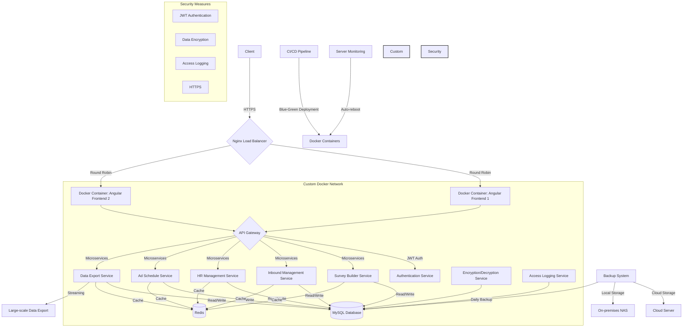

# Inbound Management System (IMS) / ERP for Clinical Trials

## Project Overview
Developed a comprehensive Inbound Management System (IMS) and ERP for managing clinical trial participant recruitment projects in hospitals and pharmaceutical companies. The system includes various modules such as survey component builder, post-research-survey integration, inbound management, HR management, ad schedule management, and role-based access control.

## Architecture

## Key Features
- Survey component builder system
- Integration of posts, research, and surveys
- Inbound survey management
- Human resources management
- Advertising schedule management
- Large-scale data export (up to 100,000 rows)
- Role-based access control

## Technical Implementation
- Automated server management for environments without real-time management capabilities
- Real-time server status monitoring with automatic reboot on error detection
- Designed and implemented a small-scale ERP including a medical research consultation platform
- Developed using Express.js, Angular2+, MySQL, and Redis
- Implemented zero-downtime operations through containerization with Docker and Nginx-based round-robin load balancing
- Utilized blue-green deployment strategy with Docker containers
- Migrated from a single-process API in PM2 environment to a microservices architecture (MSA) through Docker containerization
- Established a daily database backup system with redundancy across cloud servers and on-premises NAS

## Achievements
- Automated management of company operations
- Reduced data entry and generation time from over 6 hours to 30 minutes for identical tasks
- Implemented role-based access control, enabling task allocation based on employee positions
- Enabled server operations without on-site developer presence
- Integrated survey creation and customer information collection, replacing Google Forms with a custom builder
- Improved operational efficiency through category-based ad schedule management
- Optimized large-scale data exports using streaming to prevent file generation with each creation

## Technologies Used
- Backend: Express.js, Node.js
- Frontend: Angular2+
- Database: MySQL, Redis
- DevOps: Docker, Nginx, PM2
- Cloud services and on-premises NAS for backup
- Microservices Architecture (MSA)
